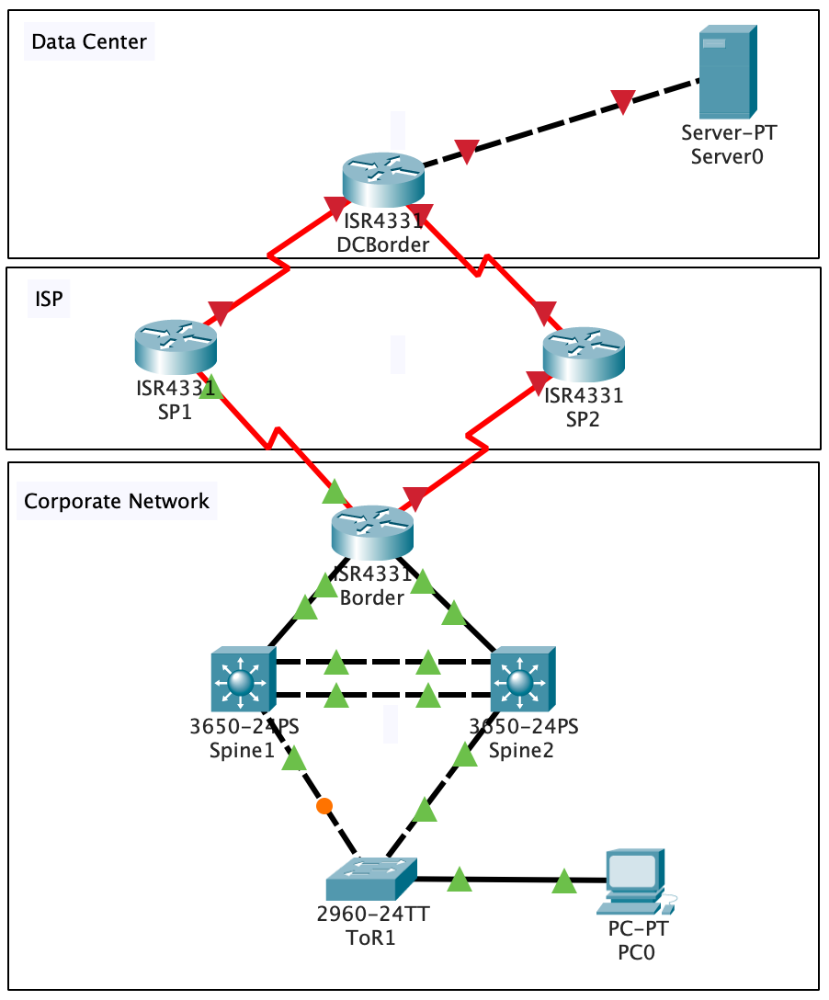

# Cisco Packet Tracer Lab
The objective of this task is to configure the following network:


Configuration guidlines:
- Corporate network
  - Corporate network IP address range - 192.168.64.0/22
  - Corporate network AS Number - AS65411
  - Corporate network IPv6 address range - fc00:0:40::/48
  - User VLAN - VLAN101 (name User101)
  - Dummy VLAN - VLAN999 (name Dummy)
  - VTP mode - transparent
  - STP Root - Spine1
  - HSRP Master - Spine1
  - OSPF Area 0
- ISP Network
  - SP1 Network IP address range - 10.10.0.0/16
  - SP1 Network IPv6 address range - fc00:0:80::/48
  - SP1 AS Number - AS65401
  - SP2 Network IP address range - 10.11.0.0/16
  - SP2 Network IPv6 address range - fc00:0:c0::/48
  - SP2 AS Number - AS65402
- DC Network
  - DC Network IP address range - 172.20.0.0/16
  - DC Network IPv6 address range - fc00::/48
  - DC Network AS Number - AS65412
  
#### Introduction
Enable mode and Configuration mode
```
enable
configure terminal
```
Exit from configuration mode and write configuration to NVRAM
```
end
write
```
Userful show commands
```
show vtp status
show cdp neigh
show int status
show ip int br
show int trunk
```
Useful diagnostic commands
```
ping <ip address>
```
#### 1.  Initial devices setup, L2 Configuration and IP addresses configuration
##### 1.1 Configure devices hostname
Setting up hostname
```
hostname <name>
```
##### 1.2 Configure VTP mode transparent for all switches (more information available here - https://www.cisco.com/c/en/us/td/docs/switches/lan/catalyst3650/software/release/16-12/configuration_guide/vlan/b_1612_vlan_3650_cg/m-1612-vlan-vtp-cg.html)
```
vtp mode transparent
```
##### 1.3 Configure VLANs for all switches (more information available here - https://www.cisco.com/c/en/us/td/docs/switches/lan/catalyst3650/software/release/16-12/configuration_guide/vlan/b_1612_vlan_3650_cg/m-1612-vlan-vlan-cg.html)
```
vlan <id>
  name <name>
```
##### 1.4 Configure access port on ToR1
```
interface X
  switchport mode access
  switchport access vlan <id>
  spanning-tree portfast
```
##### 1.5 Configure trunk interfaces between switches (more information available here - https://www.cisco.com/c/en/us/td/docs/switches/lan/catalyst3650/software/release/16-12/configuration_guide/vlan/b_1612_vlan_3650_cg/m-1612-vlan-trunk-cg.html)
```
interface <X>
  switchport trunk encap dot1q
  switchport trunk allowed vlan <id>
  switchport trunk native vlan <id>
  switchport mode trunk
```
##### 1.6 Configure IP addresses on router interfaces
```
interface <X>
  ip address <address> <mask>
```
#### 1.7 Configure IP address on switch interfaces
```
interface <X>
  no switchport
  ip address <address> <mask>
```
### 2 Spanning Tree and and L3 configuration on switches
#### 2.1 Spanning Tree mode and root configuration
```
spanning-tree mode rapid-pvst
spanning-tree vlan <X> root
```
#### 2.2 L3 and HSRP configuration on switches
```
interface vlan<x>
  ip address <address> <mask>
  standby <ip address>
  standby priority <priority>
```
### 3 Dynamic routing configuration
#### 3.1 OSPF Configuration
```
router ospf <id>
  network <net> <wildcard> area <x>
  default-information originate
ip route 0.0.0.0 0.0.0.0 null0
```
#### 3.2 BGP Configuration
```
router bgp <as-num>
  network <net> <mask>
  neighbor <ip> remote-as <as-num>
ip route <net> <mask> null0
```
